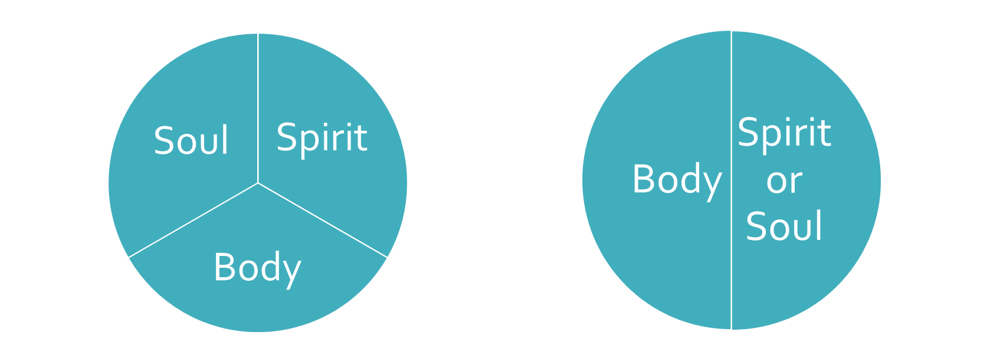
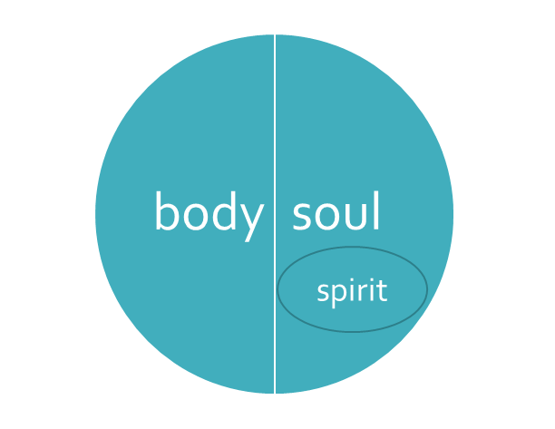

[Back to home](./../index.md)

# Do we read and understand anything other than what is written?

##### 2 Cor 1:13
>For we are not writing to you anything other than what you read and understand and I hope you will fully understand, and I hope you will understand until the end;

- Do we add and remove from God's Word?
- Do we read and understand anything other than what is written?

Let's use the question: Are we made of two or three parts to evaluate it?

Historically man creates frameworks to "help" in the process of understanding the Bible. In this case, the framework is two or three parts. Looking at man's thinking and not God's, we narrow the possibilities to consider. Again in this case, is very confusing because they both make sense for some verses and both don't make sense in others.

### Dichotomy (two parts) or Trichotomy (three parts)?

What do you believe? Is it important to you to understand? Why?

*The answer is both and neither - so the answer may be something else

It is confusing because we are not going to the Word alone. The final result is that we can't find the answer.

Is this question important? Or not that important?*

Let's use God's Word alone and forget what man says (history and tradition) or what we think and see if we can find an answer.

#### Verses Evaluation
Let's looks these verses to see what God says

##### Psalm 31:9
>My eye is wasted away from grief, my soul and my body also.

##### Mat 10:28
>Do not fear those who kill the body but are unable to kill the soul; but rather fear Him who is able to destroy both soul and body in hell.

   

*These verses point to two parts*

##### 1 Th 5:23
>Now may the God of peace Himself sanctify you entirely; and may your spirit and soul and body be preserved complete, without blame at the coming of our Lord Jesus Christ.

  

*This verse clearly points to three parts*

##### Heb 4:12
>For the word of God is living and active and sharper than any two-edged sword, and piercing as far as the division of soul and spirit, of both joints and marrow, and able to judge the thoughts and intentions of the heart

  

*This verse demands that soul and spirit are not clearly distinct, you need God's Word to be able to parse them apart. It can not be the option where they are two separate parts because that would imply no division. So it can not be they are to separate parts. In the same way, it can not be the option where they are just one used intermittently either. This verse doesn't make sense to either of these options.*

Let's use this verse to clarify these separations

>For the word of God is living and active and sharper than any two-edged sword, and piercing as far as the division of soul and spirit, of both joints and marrow, and able to judge the thoughts and intentions of the heart

*As we can see the common relation is that one is inside the other. No big insight, just clearly written. Marrow is inside the joints and intentions of the heart is inside the thoughts. God's Word is so sharper that allows us to discern between what seems to be one.*

Based on this text we can read that the spirit is part of the soul like the marrow is part of the joint. You can have a bone without marrow and it would be dead.

#### Let's validate this option with the verses we mentioned before and others more to see if it makes sense:

##### Psalm 31:9
>My eye is wasted away from grief, my soul and my body also.

##### Mat 10:28
>Do not fear those who kill the body but are unable to kill the soul; but rather fear Him who is able to destroy both soul and body in hell.

##### 1 Th 5:23
>Now may the God of peace Himself sanctify you entirely; and may your spirit and soul and body be preserved complete, without blame at the coming of our Lord Jesus Christ.

##### John 3:3-8
>3 Jesus answered and said to him, “Truly, truly, I say to you, unless one is born again he cannot see the kingdom of God.” 
>4 Nicodemus said to Him, “How can a man be born when he is old? He cannot enter a second time into his mother’s womb and be born, can he?” 5 Jesus answered, “Truly, truly, I say to you, unless one is born of water and the Spirit he cannot enter into the kingdom of God. 6 That which is born of the flesh is flesh, and that which is born of the Spirit is <strong>spirit</strong>. 7 Do not be amazed that I said to you, ‘You must be born again.’ 8 The wind blows where it wishes and you hear the sound of it, but do not know where it comes from and where it is going; so is everyone who is born of the Spirit.”

##### John 1:12-13
>12 But as many as received Him, to them He gave the right to become children of God, even to those who believe in His name, 13 who were born, not of blood nor of the will of the flesh nor of the will of man, but of God.

##### John 6:63
>It is the Spirit who gives life; the flesh profits nothing; the words that I have spoken to you are spirit and are life. 64 But there are some of you who do not believe.”

##### Col 2:13-14
>13 When you were dead in your transgressions and the uncircumcision of your flesh, He made you alive together with Him, having forgiven us all our transgressions, 14 having canceled out the certificate of debt consisting of decrees against us, which was hostile to us; and He has taken it out of the way, having nailed it to the cross.

##### Rom 8:16
>The Spirit Himself testifies with our spirit that we are children of God,

##### Jam 2:26
>For just as the body without the spirit is dead, so also faith without works is dead.

##### Eph 2:1
>And you were dead in your trespasses and sins,

##### Isa 42:5
> Thus says God the LORD,
  Who created the heavens and stretched them out,
  Who spread out the earth and its offspring,
  Who gives breath to the people on it
  And <strong>spirit</strong> to those who walk in it,

##### Eze 11:19
>And I will give them one heart, and put a new spirit within them. And I will take the heart of stone out of their flesh and give them a heart of flesh,

##### Eze 18:31
>Cast away from you all your transgressions which you have committed and make yourselves a new heart and a new spirit! For why will you die, O house of Israel?

##### Eze 36:26-27
>26 Moreover, I will give you a new heart and put a new spirit within you; and I will remove the heart of stone from your flesh and give you a heart of flesh. 27 I will put My Spirit within you and cause you to walk in My statutes, and you will be careful to observe My ordinances.

Eze 37:1-10
>The hand of the LORD was upon me, and He brought me out by the Spirit of the LORD and set me down in the middle of the valley; and it was full of bones. 2 He caused me to pass among them round about, and behold, there were very many on the surface of the valley; and lo, they were very dry. 3 He said to me, “Son of man, can these bones live?” And I answered, “O Lord GOD, You know.” 4 Again He said to me, “Prophesy over these bones and say to them, ‘O dry bones, hear the word of the LORD.’ 5 Thus says the Lord GOD to these bones, ‘Behold, I will cause breath to enter you that you may come to life. 6 I will put sinews on you, make flesh grow back on you, cover you with skin and put breath in you that you may come alive; and you will know that I am the LORD.’ ”
>7 So I prophesied as I was commanded; and as I prophesied, there was a noise, and behold, a rattling; and the bones came together, bone to its bone. 8 And I looked, and behold, sinews were on them, and flesh grew and skin covered them; but there was no breath in them. 9 Then He said to me, “Prophesy to the breath, prophesy, son of man, and say to the breath, ‘Thus says the Lord GOD, “Come from the four winds, O breath, and breathe on these slain, that they come to life.” ’ ” 10 So I prophesied as He commanded me, and the breath came into them, and they came to life and stood on their feet, an exceedingly great army.
>11 Then He said to me, “Son of man, these bones are the whole house of Israel; behold, they say, ‘Our bones are dried up and our hope has perished. We are completely cut off.’ 12 Therefore prophesy and say to them, ‘Thus says the Lord GOD, “Behold, I will open your graves and cause you to come up out of your graves, My people; and I will bring you into the land of Israel. 13 Then you will know that I am the LORD, when I have opened your graves and caused you to come up out of your graves, My people. 14 I will put My Spirit within you and you will come to life, and I will place you on your own land. Then you will know that I, the LORD, have spoken and done it,” declares the LORD.’ ”

##### Rev 3:1
>“To the angel of the church in Sardis write:
He who has the seven Spirits of God and the seven stars, says this: ‘I know your deeds, that you have a name that you are alive, but you are dead.

### Spiritual Death
Happened in the same day Adam ate the fruit of the tree of knowledge of good and evil.
We became spiritually alive with our new birth from the Holy Spirit when we are saved by Jesus.

##### Gen 2:15
>Then the LORD God took the man and put him into the garden of Eden to cultivate it and keep it. 16 The LORD God commanded the man, saying, “From any tree of the garden you may eat freely; 17 but from the tree of the knowledge of good and evil you shall not eat, for in the day that you eat from it you will surely die.”

##### Col 2:13
>When you were dead in your transgressions and the uncircumcision of your flesh, He made you alive together with Him, having forgiven us all our transgressions,

### Physical death
Happens because we lost access to the tree of life

##### Gen 3:22-24
>Then the LORD God said, “Behold, the man has become like one of Us, knowing good and evil; and now, he might stretch out his hand, and take also from the tree of life, and eat, and live forever”— 23 therefore the LORD God sent him out from the garden of Eden, to cultivate the ground from which he was taken. 24 So He drove the man out; and at the east of the garden of Eden He stationed the cherubim and the flaming sword which turned every direction to guard the way to the tree of life.

### A very important question
Who do you believe? God or the serpent?

##### Gen 2:15
>Then the LORD God took the man and put him into the garden of Eden to cultivate it and keep it. 16 The LORD God commanded the man, saying, “From any tree of the garden you may eat freely; 17 but from the tree of the knowledge of good and evil you shall not eat, for <strong>in the day</strong> that you eat from it you will surely die.”

##### Gen 3:4
>The serpent said to the woman, “You surely will not die! 5 For God knows that in the day you eat from it your eyes will be opened, and you will be like God, knowing good and evil.”

### Conclusion
We can clearly understand the new birth Jesus talked about. It was a spiritual birth, necessary because of the spiritual death. We can clearly understand the new spirit God promised. Salvation becomes very clear when we understand what happened to Adam and consequently to us when we read and understand what is written.

We can see very clear too that what God told Adam happened in the same day, surely.

To believe in God is to believe in His Word. To believe in God's Word is to believe in Him. You can't believe in God and disbelieve His Word at the same time. They are inseparable.

We should focus in reading and understanding. If we lack understanding let's ask God. 
Let's make sure we seek God on helping us on how to study His Word. Being careful to not add or remove and to read and understand what is plainly written.

Creating a method to make sense of the Bible doesn't help but just adds to it. We will study in detail how to get understanding, discernment, wisdom, knowledge of God. As a preview you can look at Prov 2.

[Back to home](./../index.md)
