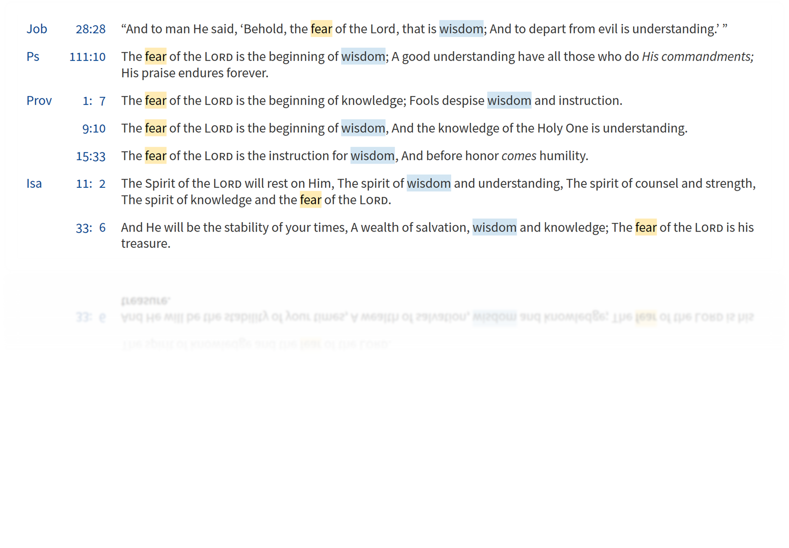
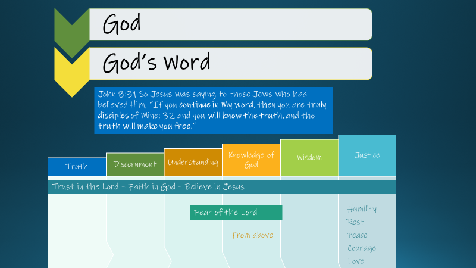
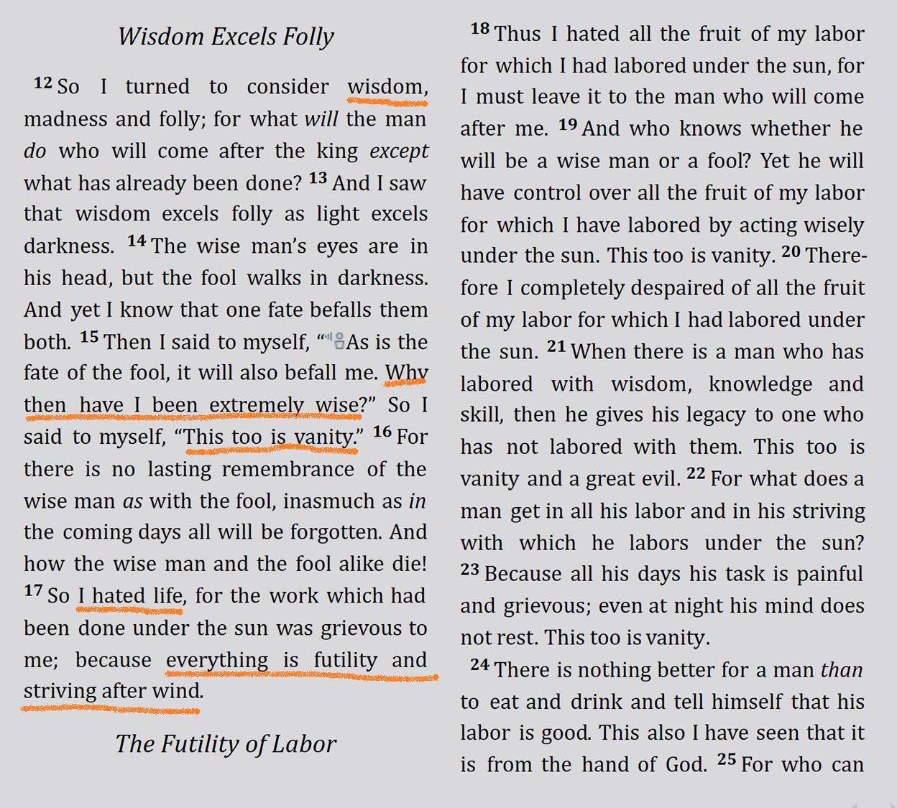
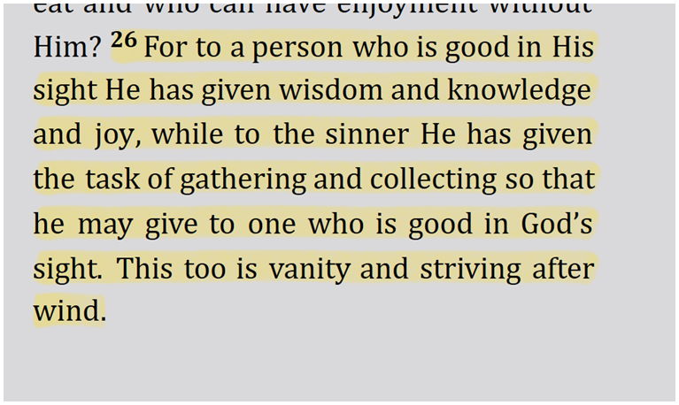
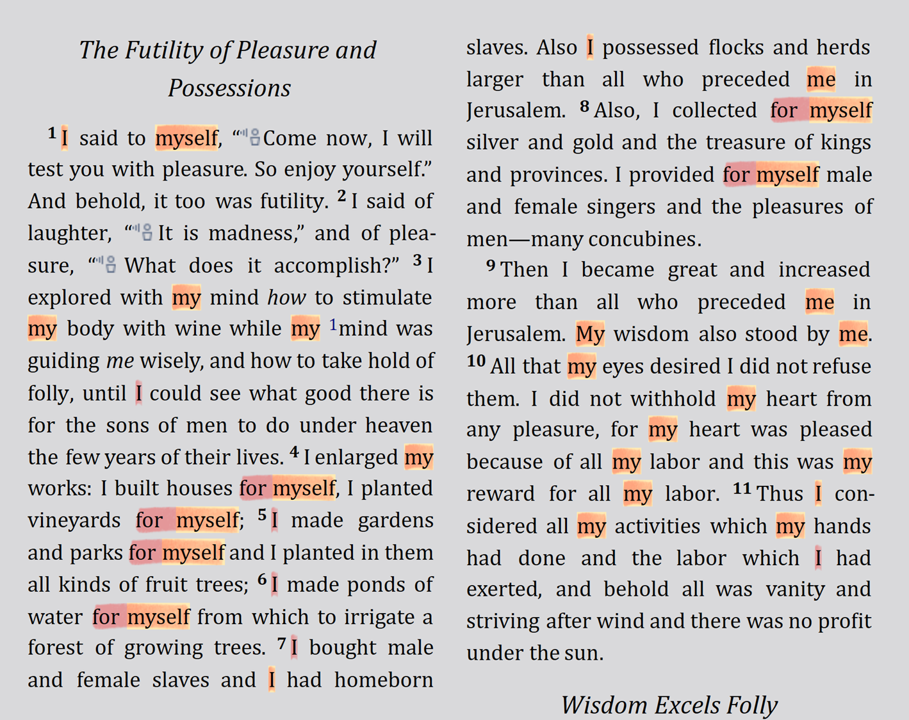

[Back to home](./../index.md)

# How to discern between good and evil

### The clear problem

1 Kings 3:9-14
 >9 So give Your servant an understanding heart to judge Your people to discern between good and evil. For who is able to judge this great people of Yours?”
  10 It was pleasing in the sight of the Lord that Solomon had asked this thing. 11 God said to him, “Because you have asked this thing and have not asked for yourself long life, nor have asked riches for yourself, nor have you asked for the life of your enemies, but have asked for yourself discernment to understand justice, 12 behold, I have done according to your words. Behold, I have given you a wise and discerning heart, so that there has been no one like you before you, nor shall one like you arise after you. 13 I have also given you what you have not asked, both riches and honor, so that there will not be any among the kings like you all your days. 14 If you walk in My ways, keeping My statutes and commandments, as your father David walked, then I will prolong your days.”

Solomon clearly identifies our incapacity to discern between good and evil. This ability is not learned, but it is given by God.

A few words become relevant in his request: give, understanding, discernment, justice, wisdom, statutes and commandments.

### The clear solution
We can see all these words in one verse.

Proverbs 2:1-12
>1 My son, if you will receive my words 
And treasure my commandments within you, 
2 Make your ear attentive to wisdom, 
Incline your heart to understanding; 
3 For if you cry for discernment, 
Lift your voice for understanding; 
4 If you seek her as silver 
And search for her as for hidden treasures; 
5 **Then** you will discern the fear of the LORD 
And discover the knowledge of God. 
6 For the LORD gives wisdom; 
From His mouth come knowledge and understanding. 
7 He stores up sound wisdom for the upright; 
He is a shield to those who walk in integrity, 
8 Guarding the paths of justice, 
And He preserves the way of His godly ones. 
9 Then you will discern righteousness and justice 
And equity and every good course. 
10 For wisdom will enter your heart 
And knowledge will be pleasant to your soul; 
11 Discretion will guard you, Understanding will watch over you, 
12 To deliver you from the way of evil, 
From the man who speaks perverse things;

Another term that shows up in these verses is the fear of the Lord. Here we can see more verses and what they say.

#### Let's put them together

Everything starts with God. Then, He gives us His Word, which is truth. From God and His Truth you get discernment, understanding. Then, you will discern the fear of the Lord and discover the knowledge of God. Fear of the Lord is the beginning of wisdom. Finally, you will be just and able to make right decisions. Solomon had all these, but...

### What happened to the wisest man?
##### Ecclesiastes 2

Even wisdom for him in the end was vanity. For him, everything was futility and striving after the wind.

Why? The answer is in the text before.

*Solomon's riches, wisdom, power and all material goods were not enough to satisfy him. Why? Because he was living all for himself and not for God. Let's not end like  Solomon did; let's live for God!* 

### What are your main reasons to live?
Where is your attention? On God or on the daily cares of life? On God or on the pursuit of wealth? On God or on self-satisfaction? On Jesus' Law of Freedom or on religiosity? Are you walking by the Spirit or walking according to the flesh? How much time have you spent meditating on God and His Word? Do you know the true God or are you a religious person creating your own god?

Truth, understanding, discernment, knowledge of God, and wisdom, without faith (trust) in and love of God is pointless and leads to destruction. Solomon had wisdom and didn’t end well. 

Satan knows God and truths and didn’t end well. 

True understanding, true discernment, true knowledge, true wisdom, and true ability to judge, and therefore to discern good and evil, is only provided and sustained by God, through Jesus' work, in His Word, as are all the fruits of the Spirit.

Let's ask Him! Let's seek Him! Let's know Him! Let's submit to Him!

##### Jam 1:17 
>Every good thing given and every perfect gift is from above, coming down from the Father of lights, with whom there is no variation or shifting shadow.

##### Mat 6:33
>But seek first His kingdom and His righteousness, and all these things will be added to you.

[Back to home](./../index.md)
